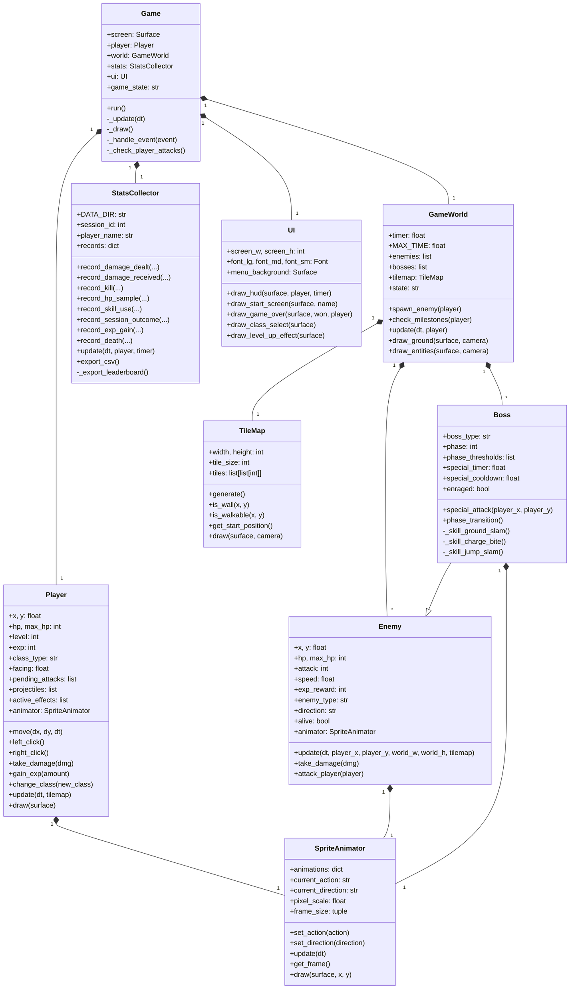

# Deadline Dungeon — Project Description

## Overview

**Deadline Dungeon** is a top-down 2D real-time action RPG implemented in Python with the Pygame library. The player controls a hero exploring a procedurally generated dungeon, fighting enemies to earn experience points and level up. A strict 10-minute timer drives the session: the player must reach Level 30 and defeat the Final Boss before time runs out, or face an enraged version of the Final Boss with 1.5× HP and 1.3× damage.

The game supports four playable classes — **Soldier**, **Knight**, **Wizard**, and **Archer** — each with distinct combat styles. Players begin as a Soldier and may change class after defeating the first mini boss at Level 10. There are no items or consumables in the game; the only means of recovery is leveling up, which restores HP to full. This design decision emphasizes combat efficiency and strategic engagement over inventory management.

All gameplay events — damage dealt, damage received, kills, deaths, HP samples, skill usage, experience gains, and session outcomes — are automatically logged to CSV files. A companion visualization script (`visualize.py`) renders a nine-panel dashboard using matplotlib, allowing the player to analyze their performance across sessions.

## Concept

### Core gameplay loop

1. **Explore** the dungeon with top-down movement (WASD)
2. **Aim** at enemies with the mouse
3. **Attack** (left click / `Q`) or use a **skill** (right click / `E`)
4. **Kill** enemies to earn experience
5. **Level up** to fully restore HP and unlock stronger stats
6. **Fight bosses** at Level 10, 20, and 30
7. **Win** by defeating the Elite Orc at Level 30 before the 10-minute timer expires

### Design pillars

| Pillar | Implementation |
|---|---|
| **Time pressure** | A 10-minute countdown forces efficient play; timeout enrages the final boss |
| **Risk-reward combat** | No items, no healing potions — only leveling up restores HP |
| **Class-based variety** | Four classes with different ranges, cooldowns, and playstyles |
| **Data-driven feedback** | Every hit and every kill is logged for the player to review |

### Milestones

| Level | Event |
|---|---|
| 1–9 | Exploration and grinding against slimes and skeletons |
| 10 | **Mini Boss 1** — Greatsword Skeleton. Defeat grants a class change choice |
| 11–19 | Class-specific combat against stronger enemies (orcs added) |
| 20 | **Mini Boss 2** — Werewolf. Defeat grants a stat buff |
| 21–29 | Final preparation against elite enemies |
| 30 | **Final Boss** — Elite Orc. Three phases. Victory ends the game |

### Classes

- **Soldier** (starter) — Balanced melee sword attacks and ranged bow skill. Attack range 55.
- **Knight** — High HP and defense. Melee sword attacks and a wide fire sword AoE skill (range 80).
- **Wizard** — Ranged fireball projectile attacks and an ice AoE skill (radius 100).
- **Archer** — Fast ranged bow attacks and a piercing arrow skill that hits multiple enemies.

### Boss mechanics

Each boss has multiple phases triggered by HP thresholds. Phase transitions increase speed and reduce the special attack cooldown:

- **Greatsword Skeleton** (Mini Boss 1, 2 phases) — Phase 2 unlocks a ground slam creating a gray shockwave.
- **Werewolf** (Mini Boss 2, 2 phases) — Phase 2 unlocks a charging lunge that damages on impact.
- **Elite Orc** (Final Boss, 3 phases) — Radial spin attack for normal hits; jump-slam special with an intense orange shockwave on landing.

## UML Class Diagram

The project implements ten classes, exceeding the minimum of five required by the course. The diagram below shows the core class hierarchy and relationships.

### Class responsibilities

| Class | Responsibility | Key collaborators |
|---|---|---|
| `Game` | Main loop, event dispatch, game state (start / playing / game over) | All other classes |
| `Player` | Player state, movement, combat (attack/skill), leveling, class switching | `SpriteAnimator`, `TileMap` |
| `Enemy` | Base AI for non-boss enemies: chasing, wandering, attacking, death animation | `SpriteAnimator`, `TileMap` |
| `Boss` | Extends `Enemy` with phase logic, animation-synced special attacks, and enrage | inherits from `Enemy` |
| `GameWorld` | Time management, enemy spawning, boss milestones, rendering coordination | `TileMap`, `Enemy`, `Boss` |
| `TileMap` | Procedural dungeon generation (rooms and corridors), wall collision queries | — |
| `SpriteAnimator` | Loads sprite folders, manages per-direction animations, frame timing, auto-cropping | — |
| `StatsCollector` | Records every gameplay event, writes nine CSV files, maintains leaderboard aggregate | — |
| `UI` | Renders HUD, start screen with name input, class selection menu, game over screen | — |
| `Animation` | Small helper wrapper for a single animation sequence (frames + duration + loop flag) | used by `SpriteAnimator` |

### Inheritance and composition

- **Inheritance:** `Boss` inherits from `Enemy`, extending its AI with phase-gated special attacks and custom rendering for shockwaves and charge trails.
- **Composition:** `Game` owns one instance each of `Player`, `GameWorld`, `StatsCollector`, and `UI`. `GameWorld` owns the `TileMap` and the list of `Enemy` and `Boss` instances. `Player`, `Enemy`, and `Boss` each own a `SpriteAnimator`.

## Statistics Collection

The `StatsCollector` class automatically records gameplay data while the player plays. After each session — or every 15 seconds via an auto-save — data is appended to CSV files in `stats_data/`. The following nine files are produced:

| # | File | What it records | Visualization |
|---|---|---|---|
| 1 | `damage_dealt.csv` | Every hit the player lands | Histogram with mean line |
| 2 | `damage_received.csv` | Every hit the player takes | Horizontal bar chart per enemy |
| 3 | `kills_per_level.csv` | Every enemy the player kills | Stacked bar chart by level range |
| 4 | `hp_over_time.csv` | HP sampled every 2 seconds | Line chart (top 5 longest sessions) |
| 5 | `skill_usage.csv` | Every attack and skill use | Stacked bar chart by class |
| 6 | `session_outcomes.csv` | One row per finished session | Pie chart win/loss |
| 7 | `exp_over_time.csv` | EXP gain events and periodic snapshots | Cumulative line chart |
| 8 | `death_cause.csv` | What killed the player each time | Pie chart by killer |
| 9 | `leaderboard.csv` | Aggregated per-session totals | Top 10 ranking table |

Every row includes `session_id`, `player_name`, and `timestamp` so data can be joined across files for per-player or per-session analysis.

## Tools and Technologies

| Tool | Purpose |
|---|---|
| Python 3.8+ | Main programming language |
| Pygame 2.5+ | Rendering, input, game loop |
| pandas | CSV loading for the visualization module |
| matplotlib | Dashboard and per-chart PNG rendering |
| Git / GitHub | Version control and submission |

## Extra Features Beyond Requirements

- **Animation-synced combat** — damage triggers at specific frames (e.g. projectiles fire on the final frame of the bow draw, melee hits 6 frames before the swing ends) for tactile feedback
- **Pixel-perfect sprite scaling** — a shared-bounding-box auto-crop keeps characters the same apparent size across idle, walk, attack, and skill animations
- **Axis-separated wall collision** — the player slides along walls instead of bouncing when blocked in one direction
- **Enemy pathfinding around obstacles** — blocked enemies try perpendicular directions to go around walls
- **Phase-gated boss specials** — mini bosses do not use their special attack until phase 2, giving the player a tutorial-like first phase
- **Auto-save** — CSV data is flushed every 15 seconds so a crash never loses more than a few seconds of data
- **Cursor-based CSV append** — `export_csv()` tracks which rows have been written, allowing in-memory records to persist for the live leaderboard summary without duplicating on disk
