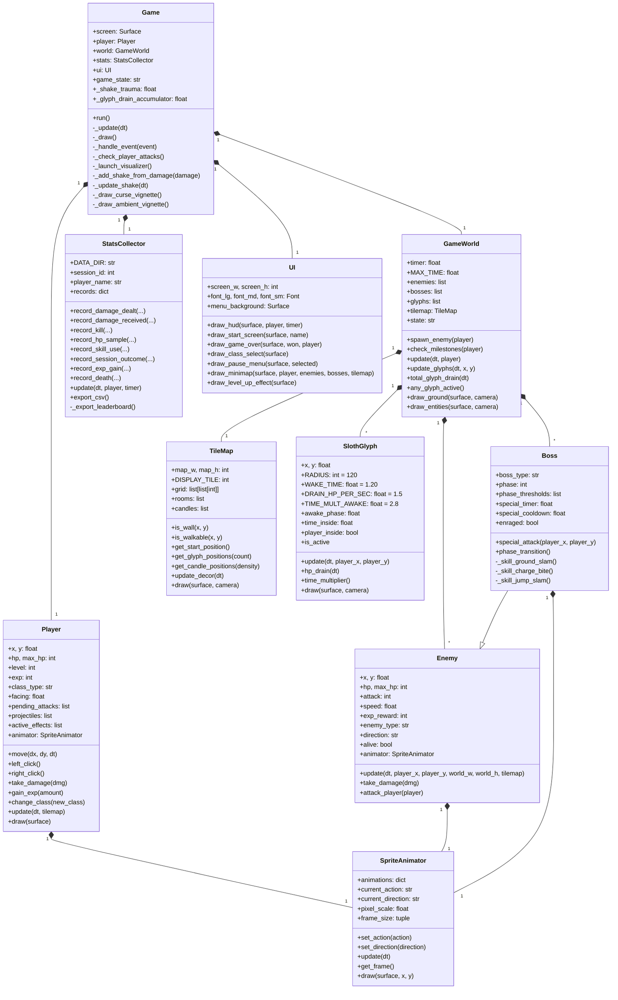

# Deadline Dungeon — Project Description

## Overview

**Deadline Dungeon** is a top-down 2D real-time action RPG implemented in Python with the Pygame library. The player controls a hero exploring a procedurally generated dungeon, fighting enemies to earn experience points and level up. A strict 10-minute timer drives the session: the player must reach Level 30 and defeat the Final Boss before time runs out, or face an enraged version of the Final Boss with 1.5× HP and 1.3× damage.

The game supports four playable classes — **Soldier**, **Knight**, **Wizard**, and **Archer** — each with distinct combat styles. Players begin as a Soldier and may change class after defeating the first mini boss at Level 10. There are no items or consumables in the game; the only means of recovery is leveling up, which restores HP to full. This design decision emphasizes combat efficiency and strategic engagement over inventory management.

All gameplay events — damage dealt, damage received, kills, deaths, HP samples, skill usage, experience gains, and session outcomes — are automatically logged to CSV files. A companion visualization script (`visualize.py`) renders a nine-panel dashboard using matplotlib, allowing the player to analyze their performance across sessions.

## Concept

### Core gameplay loop

1. **Explore** the dungeon with top-down movement (WASD)
2. **Aim** at enemies with the mouse
3. **Attack** (left click / `Q`) or use a **skill** (right click / `E`)
4. **Kill** enemies to earn experience
5. **Level up** to fully restore HP and unlock stronger stats
6. **Fight bosses** at Level 10, 20, and 30
7. **Win** by defeating the Elite Orc at Level 30 before the 10-minute timer expires

### Design pillars

| Pillar | Implementation |
|---|---|
| **Time pressure** | A 10-minute countdown forces efficient play; timeout enrages the final boss |
| **Risk-reward combat** | No items, no healing potions — only leveling up restores HP |
| **Class-based variety** | Four classes with different ranges, cooldowns, and playstyles |
| **Data-driven feedback** | Every hit and every kill is logged for the player to review |

### Milestones

| Level | Event |
|---|---|
| 1–9 | Exploration and grinding against slimes and skeletons |
| 10 | **Mini Boss 1** — Greatsword Skeleton. Defeat grants a class change choice |
| 11–19 | Class-specific combat against stronger enemies (orcs added) |
| 20 | **Mini Boss 2** — Werewolf. Defeat grants a stat buff |
| 21–29 | Final preparation against elite enemies |
| 30 | **Final Boss** — Elite Orc. Three phases. Victory ends the game |

### Classes

- **Soldier** (starter) — Balanced melee sword attacks and ranged bow skill. Attack range 55.
- **Knight** — High HP and defense. Melee sword attacks and a wide fire sword AoE skill (range 80).
- **Wizard** — Ranged fireball projectile attacks and an ice AoE skill (radius 100).
- **Archer** — Fast ranged bow attacks and a piercing arrow skill that hits multiple enemies.

### Boss mechanics

Each boss has multiple phases triggered by HP thresholds. Phase transitions increase speed and reduce the special attack cooldown. Each tier has **three randomized variants** drawn from a shared pool, so each run feels different:

- **Tier 1 (Lv. 10)** — Greatsword Skeleton / Cursed Revenant / Bone Colossus. Phase 2 unlocks a ground slam creating a gray shockwave.
- **Tier 2 (Lv. 20)** — Werewolf / Alpha Werewolf / Shadow Stalker. Phase 2 unlocks a charging lunge with a wide bite AoE on impact.
- **Tier 3 (Lv. 30)** — Elite Orc / Warchief Zarkoth / Berserker Grom. Radial spin attack for normal hits; jump-slam special with an intense orange shockwave on landing.

### Sloth Glyphs (cursed lingering hazard)

Five **Sloth Glyphs** spawn each run as cursed pentagram sigils on the dungeon floor. The moment the player is inside a glyph's radius (120 px) for **1.20 seconds** — even while moving — the glyph wakes and starts:

- **Draining HP** at 1.5 HP/second
- **Accelerating the deadline timer 2.8x** (only the timer; enemies and AI run at normal speed)

The glyph stays awake until the player walks out of its radius. Visually it's drawn as an inverted pentagram inside two concentric runed rings, with crimson halo, drifting embers, and a "✠ Cursed by Sloth ✠" warning text on the HUD. This mechanic reinforces the deadline theme: stay too long in one spot and the deadline catches up to you.

### Screen shake on damage

Trauma-based screen shake feedback when the player takes a hit. Damage bumps trauma by `0.12 + 0.025 × damage` (capped at 0.95), and the per-frame offset is `trauma² × 18 px` so heavy hits feel disproportionately bigger than light ones. Trauma decays at 1.6/sec. Only the world camera shakes — the HUD, minimap and boss HP bar stay still so numbers remain readable.

### In-game stats dashboard launcher

The matplotlib dashboard can be opened directly from inside the game without quitting:

- **Start screen:** press **Ctrl+V**
- **Game-over screen:** press **V**

The launcher flushes the current session's CSVs first, then spawns `visualize.py` as a separate process so the game keeps running.

### Atmospheric polish

- **Pixel-art gothic candles** flicker along the dungeon walls — animated wax body, drips, teardrop flame, soft warm halo
- **Floor decorations** (procedurally placed): bones with skull fragments, jagged cracks, dried-blood splatters, corner cobwebs
- **Ambient screen vignette** softly darkens the screen edges so the dungeon feels candle-lit rather than evenly lit
- **Pause menu** (ESC) with Resume / Restart / Quit
- **Minimap** in the top-right corner with player and boss markers

## UML Class Diagram

The project implements ten classes, exceeding the minimum of five required by the course. The diagram below shows the core class hierarchy and relationships.

### Class responsibilities

| Class | Responsibility | Key collaborators |
|---|---|---|
| `Game` | Main loop, event dispatch, game state, screen shake, glyph drain integration, dashboard launcher | All other classes |
| `Player` | Player state, movement, combat (attack/skill), leveling, class switching | `SpriteAnimator`, `TileMap` |
| `Enemy` | Base AI for non-boss enemies: chasing, wandering, attacking, death animation | `SpriteAnimator`, `TileMap` |
| `Boss` | Extends `Enemy` with phase logic, animation-synced special attacks, multi-tier variants, enrage | inherits from `Enemy` |
| `GameWorld` | Time management, enemy spawning, boss milestones, glyph orchestration, rendering coordination | `TileMap`, `Enemy`, `Boss`, `SlothGlyph` |
| `TileMap` | Procedural dungeon generation, wall collision, candle + floor-decor placement | — |
| `SlothGlyph` | Cursed lingering-hazard rune: detects player presence, drains HP, multiplies deadline speed | drawn by `GameWorld` |
| `SpriteAnimator` | Loads sprite folders, manages per-direction animations, frame timing, auto-cropping | — |
| `StatsCollector` | Records every gameplay event, writes nine CSV files, maintains leaderboard aggregate | — |
| `UI` | Renders HUD, start screen, class select, game over, pause menu, minimap | — |

### Inheritance and composition

- **Inheritance:** `Boss` inherits from `Enemy`, extending its AI with phase-gated special attacks, animation-synced dash / jump-slam movement, and custom rendering for shockwaves and charge trails.
- **Composition:** `Game` owns one instance each of `Player`, `GameWorld`, `StatsCollector`, and `UI`. `GameWorld` owns the `TileMap`, the list of `Enemy` and `Boss` instances, and the list of `SlothGlyph` instances. `Player`, `Enemy`, and `Boss` each own a `SpriteAnimator`.

## Statistics Collection

The `StatsCollector` class automatically records gameplay data while the player plays. After each session — or every 15 seconds via an auto-save — data is appended to CSV files in `stats_data/`. The following nine files are produced:

| # | File | What it records | Visualization |
|---|---|---|---|
| 1 | `damage_dealt.csv` | Every hit the player lands | Histogram with mean line |
| 2 | `damage_received.csv` | Every hit the player takes | Horizontal bar chart per enemy |
| 3 | `kills_per_level.csv` | Every enemy the player kills | Stacked bar chart by level range |
| 4 | `hp_over_time.csv` | HP sampled every 2 seconds | Line chart (top 5 longest sessions) |
| 5 | `skill_usage.csv` | Every attack and skill use | Stacked bar chart by class |
| 6 | `session_outcomes.csv` | One row per finished session | Pie chart win/loss |
| 7 | `exp_over_time.csv` | EXP gain events and periodic snapshots | Cumulative line chart |
| 8 | `death_cause.csv` | What killed the player each time | Pie chart by killer |
| 9 | `leaderboard.csv` | Aggregated per-session totals | Top 10 ranking table |

Every row includes `session_id`, `player_name`, and `timestamp` so data can be joined across files for per-player or per-session analysis.

## Tools and Technologies

| Tool | Purpose |
|---|---|
| Python 3.8+ | Main programming language |
| Pygame 2.5+ | Rendering, input, game loop |
| pandas | CSV loading for the visualization module |
| matplotlib | Dashboard and per-chart PNG rendering |
| pytest | Unit test framework (`tests/`) |
| GitHub Actions | Continuous integration on push / PR |
| Git / GitHub | Version control and submission |

## Extra Features Beyond Requirements

### Gameplay & feel
- **Sloth Glyphs** — five cursed pentagram sigils per dungeon that drain HP and accelerate the deadline timer (2.8x) while you're inside their radius, embodying the "stop procrastinating" theme
- **Trauma-based screen shake** — every hit shakes the screen with intensity scaled by damage; `trauma**2` scaling makes heavy hits feel disproportionately bigger than light ones
- **Boss variant pools** — each boss tier has 3 randomized variants so each run feels different
- **Phase-gated boss specials** — mini bosses do not use their special attack until phase 2
- **Animation-synced combat** — damage triggers at specific animation frames for tactile feedback
- **Timeout drama** — when the deadline expires, the final boss drops in front of the player with a shockwave instead of spawning across the map

### Visuals & polish
- **Pixel-art gothic candles** — animated wax body, drips, teardrop flame, flickering warm glow
- **Procedural floor decorations** — bones, skull fragments, cracks, dried-blood splatters, corner cobwebs, baked into the map surface for zero per-frame cost
- **Ambient screen vignette** — soft edge darkening so the dungeon feels candle-lit
- **Cursed-glyph vignette** — crimson edge ink + warning text while a glyph is siphoning the player
- **Pixel-perfect sprite scaling** — shared-bounding-box auto-crop keeps characters the same apparent size across all animations
- **Axis-separated wall collision** — player slides along walls instead of bouncing
- **Enemy pathfinding around obstacles** — blocked enemies try perpendicular directions

### UX & quality of life
- **In-game stats dashboard** — Ctrl+V (start screen) / V (game over) opens the matplotlib dashboard as a separate process
- **Pause menu** with Resume / Restart / Quit, mouse + keyboard navigable
- **Minimap** in the top-right corner showing room layout + player + boss markers
- **Auto-save** — CSV data flushed every 15 seconds, never losing more than a few seconds on a crash
- **Cursor-based CSV append** — only newly recorded rows are written, no duplication on disk
- **Controls list on start screen** so the player learns the keys before playing

### Engineering practices
- **84-test pytest suite** covering tilemap, glyphs, player, enemy, boss, stats collector, animation, and game world (`tests/`)
- **GitHub Actions CI** runs the full test suite on every push and pull request, across Python 3.10 / 3.11 / 3.12 (`.github/workflows/test.yml`)
- **CI badge** in README shows the current test status at a glance
