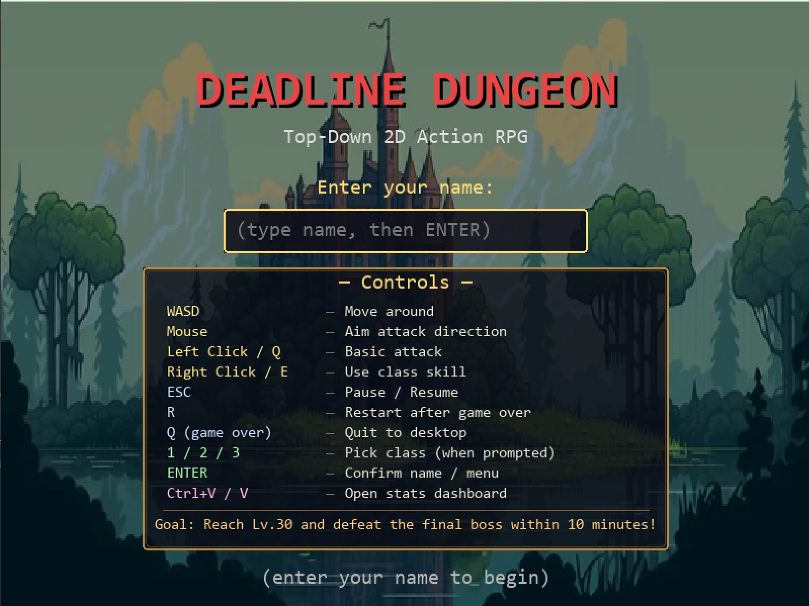

# Deadline Dungeon

[](https://github.com/Kantee22/Deadline-Dungeon/actions/workflows/test.yml)

📺 **[Watch the demo video on YouTube](https://youtu.be/NhRLgldU7wI)**

A top-down 2D real-time action RPG built with Python and Pygame. Race against a 10-minute timer to reach Level 30 and defeat the Final Boss — the Elite Orc.

**Project for:** Computer Programming II (01219117), Kasetsart University, Department of Computer Engineering  
**Student:** Kantee Laibuddee (6710545440)



## Features

- 4 playable classes with distinct combat styles: **Soldier**, **Knight**, **Wizard**, **Archer**
- 3 unique boss encounters with multi-phase patterns: **Greatsword Skeleton**, **Werewolf**, **Elite Orc**
- 3 regular enemy types: **Slime**, **Skeleton**, **Orc**
- Procedurally generated dungeon maps with walls and rooms
- Class change system after defeating the first mini boss
- Time-pressure mechanic — Final Boss gets enraged if you run out of time
- Automatic statistics collection to CSV for post-game analysis
- Built-in data visualization dashboard

## Installation

### Requirements

- Python 3.8 or higher
- pip

### Step 1: Clone the repository

```bash
git clone https://github.com/<your-username>/deadline-dungeon.git
cd deadline-dungeon
```

### Step 2: (Optional) Create a virtual environment

```bash
python -m venv venv
# On Windows:
venv\Scripts\activate
# On macOS / Linux:
source venv/bin/activate
```

### Step 3: Install dependencies

```bash
pip install -r requirements.txt
```

This installs `pygame`, `pandas`, and `matplotlib`.

## How to Run

### Running the game

```bash
python main.py
```

On the start screen:

1. Type your player name (max 14 characters)
2. Press `Enter` to begin
3. Survive, level up, and defeat all 3 bosses before the 10-minute timer expires

### Controls

| Action | Primary | Alternative (Mac-friendly) |
|---|---|---|
| Move | `W` `A` `S` `D` or arrow keys | — |
| Aim direction | Mouse cursor | — |
| Attack | Left click | `Q` |
| Skill | Right click | `E` |
| Class select (after Lv.10 boss) | `1` Knight, `2` Wizard, `3` Archer | — |
| Restart | `R` (game over screen) | — |
| Quit | `Q` (game over screen) | — |

### Viewing statistics

After playing at least one session, statistics are saved to `stats_data/` as CSV files.

To generate the visualization dashboard:

```bash
python visualize.py
```

Other options:

```bash
python visualize.py --save           # Also save each chart as PNG
python visualize.py --save --nogui   # Save PNGs without opening a window
python visualize.py --summary        # Print text summary only (no window)
```

Output images are saved to `screenshots/visualization/`. A full write-up of every chart lives in [screenshots/visualization/VISUALIZATION.md](screenshots/visualization/VISUALIZATION.md).

## Project Structure

```
deadline-dungeon/
├── main.py                 # Game entry point and main loop
├── player.py               # Player class, classes, combat
├── enemy.py                # Base enemy AI and behavior
├── boss.py                 # Boss subclass with phases and specials
├── game_world.py           # World state, timer, spawning, milestones
├── tilemap.py              # Procedural dungeon generation
├── animation.py            # Sprite animation loader and renderer
├── ui.py                   # HUD, menus, name input
├── stats_collector.py      # Collects gameplay data, exports to CSV
├── visualize.py            # Matplotlib dashboard reading stats CSVs
├── requirements.txt        # Python dependencies
├── LICENSE                 # MIT License
├── README.md               # This file
├── DESCRIPTION.md          # Project overview and UML
├── Dungeon_Tileset.png     # Map tileset
├── images/                 # Character and enemy sprites
│   ├── menu/
│   ├── soldier/
│   ├── knight/
│   ├── wizard/
│   ├── archer/
│   └── enemies/
├── screenshots/
│   ├── gameplay/           # In-game screenshots
│   └── visualization/      # Dashboard PNGs + VISUALIZATION.md
│       └── VISUALIZATION.md
└── stats_data/             # Generated CSV data (auto-created)
```

## Troubleshooting

### `pygame not found`
Make sure you installed dependencies: `pip install -r requirements.txt`

### Game window does not appear
On Linux, SDL may need a display driver. Ensure you are running in a desktop environment, not a headless terminal.

### `visualize.py` shows "No data available"
Play at least one session first. CSV files are written to `stats_data/` automatically during play and on quit.

### `pandas.errors.ParserError`
If you have CSV files from an older version of the game, some rows may have a different column count. The current `visualize.py` handles this automatically by skipping bad rows. If the issue persists, delete the `stats_data/` folder and play a fresh session.

## Tests & CI

This project ships with a pytest test suite (**84 tests** across 8 modules) and a
GitHub Actions workflow that runs them on every push and pull request — across
Python 3.10, 3.11, and 3.12.

```
tests/
├── conftest.py                  # headless pygame setup (SDL dummy driver)
├── test_animation.py             #  4 tests
├── test_boss.py                  #  9 tests
├── test_enemy.py                 #  6 tests
├── test_game_world.py            #  7 tests
├── test_glyphs.py                # 13 tests
├── test_player.py                # 16 tests
├── test_stats_collector.py       # 13 tests
└── test_tilemap.py               # 16 tests
```

To run the tests locally:

```bash
pip install pytest
pytest tests/ -v
```

The workflow file is at `.github/workflows/test.yml`. After pushing to GitHub,
the Actions tab will show a green checkmark next to each commit when all tests
pass.

## Credits & Asset Attribution

This project uses third-party pixel-art asset packs purchased from itch.io.
All assets are used under the licenses provided by their original creators.

### Dungeon tileset

**Pixel_Poem — Dungeon Tileset II**
https://pixel-poem.itch.io/dungeon-assetpuck

Used for the procedurally generated dungeon floor and wall tiles
(`Dungeon_Tileset.png` and the `TileMap` class).

### Character & enemy sprites

**Zerie — Tiny RPG Character Asset Pack v1.03**
https://zerie.itch.io/tiny-rpg-character-asset-pack

Used for the player classes (Soldier, Knight, Wizard, Archer), regular
enemies (Slime, Skeleton, Orc), and boss sprites (Greatsword Skeleton,
Werewolf, Elite Orc), located under the `images/` folder.

All other code, design, gameplay logic, and visual effects (Sloth Glyphs,
candles, screen shake, vignettes, floor decorations, UI/HUD) are original
work by the project author.

## License

MIT License — see [LICENSE](LICENSE) for details. The MIT license applies
to the source code only; the third-party asset packs listed above remain
under their original licenses from their respective creators.
