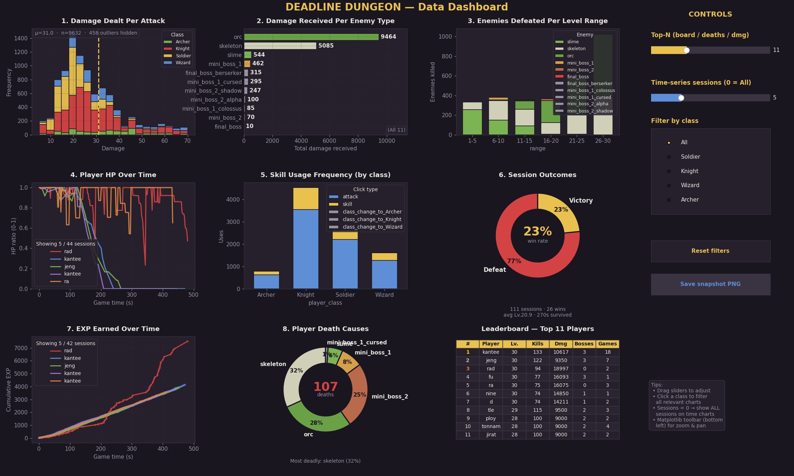
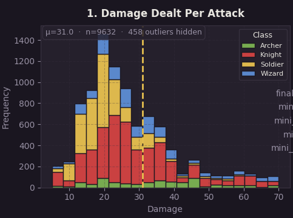
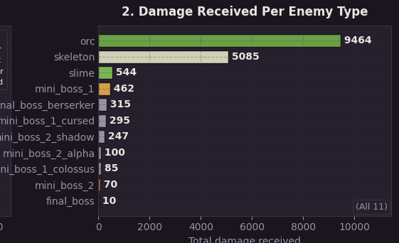
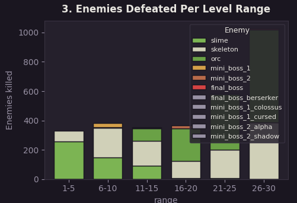
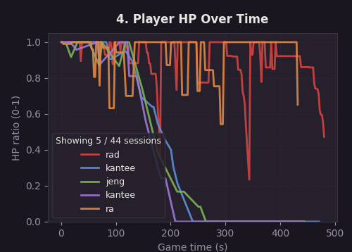
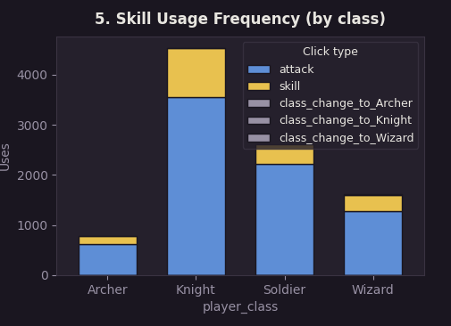
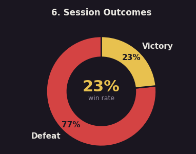
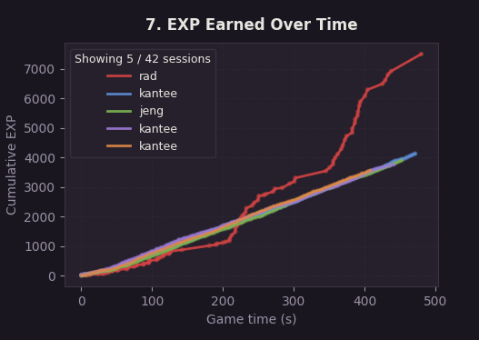
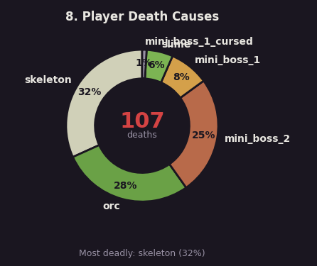
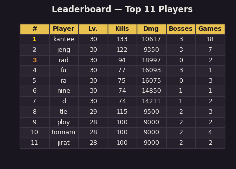

# Deadline Dungeon — Data Visualization

This document describes the data components of *Deadline Dungeon*. The
game collects 8 features of gameplay data plus an aggregated leaderboard
and presents them in a single interactive matplotlib dashboard
(`visualize.py`).

All data is stored as CSV files in the `stats_data/` folder, with one
file per feature. Every row carries `session_id`, `player_name`, and
`timestamp` so data from different sessions can be joined and compared.

The dashboard can be opened from inside the game (start screen: **Ctrl+V**,
game-over screen: **V**) or directly via `python visualize.py`.

## Dashboard Overview



The dashboard shows every feature on a single page styled with a dark
gothic-dungeon theme. The right side has a control panel:

- **Top-N slider** — controls how many rows appear in the leaderboard,
  death-cause and damage-received charts.
- **Sessions slider** — controls how many recent sessions are drawn on
  the HP-over-time and EXP-over-time charts (0 = show all).
- **Class filter** — restricts damage and skill data to one player class.
- **Reset** — restore default filter values.
- **Save snapshot** — export the current view as a PNG.

All charts refresh live when any control is moved.

## 1. Damage Dealt Per Attack



Histogram of individual damage hits, grouped by player class
(Soldier / Knight / Wizard / Archer). Each class is plotted as its own
colored distribution so the player can compare damage profiles: Wizard
and Archer trend toward higher peaks (big-hit projectiles), while Soldier
and Knight show flatter distributions centered on lower values
(consistent melee damage). The class radio on the control panel
restricts this chart to a single class.

## 2. Damage Received Per Enemy Type



Horizontal bar chart of the top enemies by total damage dealt to the
player, showing which monsters are the biggest threats. Each bar is
labeled with the enemy type and colored by the same palette as the
kills chart. The Top-N slider controls how many enemy types are
displayed.

## 3. Enemies Defeated Per Level Range



Stacked bar chart that breaks down enemy kills by player level. Each
bar represents one level band, with segments colored by enemy type
(slime, skeleton, orc, mini bosses, final boss). It reveals how enemy
composition shifts as the player levels up — early levels dominated by
slimes, mid-game by skeletons, and late game by orcs and bosses — and
also shows which levels the player spent the most time on.

## 4. Player HP Over Time



Time-series line chart showing the player's HP ratio (current_hp /
max_hp) across the 10-minute session, sampled every 2 seconds. Multiple
sessions are overlaid as transparent lines so the shape of a typical run
is visible, with the most recent sessions drawn more prominently. Useful
for spotting dangerous moments (HP dips) and for comparing survival
patterns between runs. The Sessions slider controls how many sessions
are drawn.

## 5. Skill Usage Frequency (by class)



Grouped bar chart comparing the hit rate (percent of clicks that connect
with an enemy) of basic attacks vs. class skills, for each player class.
It shows which classes land their attacks most reliably and whether the
class skill is more or less accurate than the basic attack. Helpful for
balancing class design and for spotting which abilities feel clumsy to
aim.

## 6. Session Outcomes



Pie chart summarizing win/loss ratio across all recorded sessions, split
into three categories:

- **Victory** — final boss defeated.
- **Defeat** — player died.
- **Timeout** — 10-minute deadline hit before reaching the final boss.

A high-level view of how often players successfully finish the run under
the time pressure of the *deadline* theme.

## 7. EXP Earned Over Time



Time-series line chart of cumulative EXP gained across the session.
Like the HP chart, multiple sessions are overlaid. Steep segments
indicate fast leveling (usually during boss kills or dense spawns),
while flat segments indicate idle or wandering time — and now also
periods spent inside *Sloth Glyphs*, where the deadline races but the
player isn't engaging enemies. Helps identify which strategies lead to
the fastest progression.

## 8. Player Death Causes



Horizontal bar chart ranking the enemies that killed the player most
often, across all recorded deaths. Each bar shows the count of deaths
caused by that enemy type, colored by enemy. The Top-N slider changes
how many entries are shown. Together with *Damage Received Per Enemy
Type* (chart #2), this reveals which enemies are truly dangerous (high
damage *and* high kill count) versus which ones merely chip at the
player.

## Leaderboard — Top Players



Horizontal bar chart showing the Top-N sessions ranked first by peak
level reached, then by total kills, then by total damage dealt. Each
bar is labeled with the player's name and level, and colored by the
player's class for quick visual comparison. The number of bars adjusts
with the Top-N slider.

## Data Source

All charts are generated from CSV files in `stats_data/`, written
automatically by `stats_collector.py` during gameplay. Stats are flushed
to disk every 15 seconds (and at session end), so data is preserved even
if the game crashes.

To regenerate the visualizations:

```
python visualize.py            # open interactive dashboard
python visualize.py --save     # export all charts as PNGs to screenshots/visualization/
python visualize.py --summary  # print a text summary to the console
```
